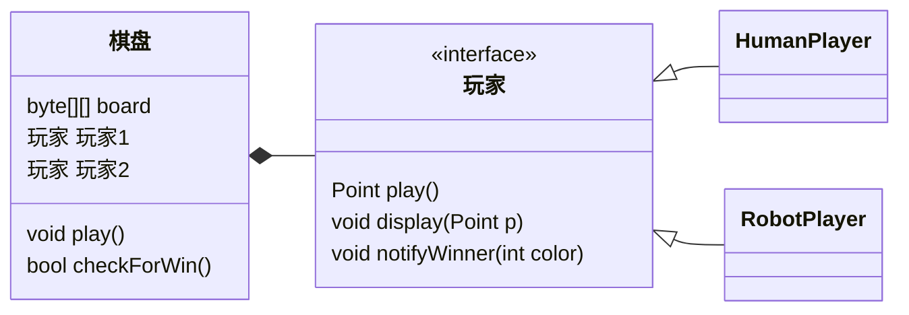
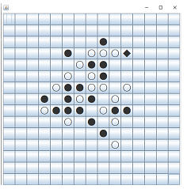

之前说想写一些比较大型的算法，想了半天，还是觉得写五子棋的AI比较合适。一则因为自己研究过这个，有一些基础，二则尽管现在网上有很多五子棋AI算法的资料，但是确实都有些晦涩难懂。就想着借这个机会，凭自己的理解，尽量的讲通俗一些。然而，这个算法确实有些复杂，想要通俗一些需要较大的篇幅，一篇文章难以讲完，这里就分很多个章节，一点一点的深入探讨。为了让文章更加通俗一些，我会略去一部分很简单但是占用篇幅很长的代码，改为用几行注释说明。

# 框架的搭建

首先，我们计划是做一个五子棋AI，也就是说让玩家和这个AI对下。整个游戏的框架是这样的：



其中，棋盘是一个`Object`，存放当前的棋局情况，通知每个`Player`“轮到你下棋了”、“对方下了什么棋”、“游戏结束，XXX获胜”等消息，并且从每个`Player`那里获取他下了什么棋。两个`Player`分别是人类玩家和AI。`Player`的基类应该是一个`interface`，里面只有三个方法。人类玩家和AI是它的子类，分别实现这三个方法。

```java
public interface Player {
   Point play();
   void display(Point p);
   void notifyWinner(int color);
}
```

```java
public final class Point {
   public final int x;
   public final int y;
   public Point(int x, int y) {
      this.x = x;
      this.y = y;
   }
   @Override
   public String toString() {return "(" + x + "," + y + ")";}
}
```

解释一下：

 - `play`方法，告知“轮到你下棋了”，并且返回一个`Point`，也就是下一步下的棋。对于人类玩家，则就是阻塞，等待玩家在界面上选取一个点，并且将这个点的坐标返回。对于AI，则是直接开始用我们的AI算法进行计算，并返回计算结果。
 - `void display(Point p)`方法，告知“对方下了什么棋”。对于人类玩家，则就是将对方下了的棋在界面上显示出来。对于AI，则是将对方下了的棋记在AI的缓存中，以便后续的计算。
 - `void notifyWinner(int color)`方法，告知“游戏结束，XXX玩家赢了”。对于人类玩家，则就是在界面上展示谁赢了的文字及特效，并且从此之后再点击棋盘就不再有反应了。对于AI，则是通知AI不要再计算了。

当然了，如果打算连续下多盘棋，可能还需要一个`reset`方法，通知人类玩家和AI清空当前棋盘。当然了，这个和我们的算法关系不大就不列出来了。

然后，我们的`interface Player`需要两个实现类，分别叫做`HumanPlayer`和`RobotPlayer`，这个`RobotPlayer`的`play`方法将是五子棋AI算法的核心内容，后面会花费大量篇幅进行讲解。

接下来就是我们的棋盘：

```java
public abstract class Constant {
   public static int MAX_LEN = 15;
}
```

```java
public class ChessBoard {
   private byte[][] board = new byte[Constant.MAX_LEN][Constant.MAX_LEN];
   private Player[] players = new Player[2];
   private int whoseTurn = 0;
   private int count = 0;
   private boolean isEnd = false;
   
   private boolean checkForWin(Point p) {
      /* 因为篇幅问题，此处省略十几行代码 */
      /* 这个函数就是在下完每一步棋时调用，只需要判断以这步棋若形成五连珠即可判定获胜 */
      return false;
   }

   public void play() {
      if (isEnd) return;
      Point p = players[whoseTurn].play(); //调用Player的play方法，获取下一步下的棋
      if (board[p.y][p.x] != 0) //严谨，以防万一
         throw new IllegalArgumentException(p.toString() + board[p.y][p.x]);
      board[p.y][p.x] = (byte) (whoseTurn + 1);
      System.out.println((whoseTurn == 0 ? "黑" : "白") + p.toString()); //打印日志
      if (++count == Constant.MAX_LEN * Constant.MAX_LEN) //严谨，如果棋盘下满了游戏结束
         isEnd = true;
      if (checkForWin(p)) //如果下了这步棋后赢了，游戏结束
         isEnd = true;
      whoseTurn = 1 - whoseTurn; //切换当前下棋的人
      players[whoseTurn].display(p); //调用Player的display方法，告知他对方下了哪步棋
      if (isEnd) { //如果下完这一步棋后有一方赢了，则调用Player的notifyWinner方法通知
         players[0].notifyWinner(2 - whoseTurn);
         players[1].notifyWinner(2 - whoseTurn);
      }
   }
   
   public static void main(String[] args) {
      ChessBoard b = new ChessBoard();
      b.players[0] = new HumanPlayer(1); //这里我从构造函数中传入了颜色，例如1表示执黑，2表示执白
      b.players[1] = new RobotPlayer(2);
      while (b.getWinner() == null) {
         b.play();
      }
   }
}
```

棋盘的代码确实很简单易懂，也做了很多注释，就不多介绍了。

接下来，就只剩下`HumanPlayer`和`RobotPlayer`的实现了。

# 人类玩家

人类玩家无非就是实现三个方法：
 - `play`方法，阻塞等待玩家点击棋盘上的一个点并返回这个点
 - `display`方法，将AI下的棋展示在界面上
 - `notifyWinner`方法，显示一行字“你赢（输）了”

这段代码与本文无关，就不贴出来了，我把我做的这个丑陋的界面贴出来展示一下，哈哈。



（不要吐槽我的界面，这不是重点。）

# RobotPlayer

AI才是重点内容，涉及了大量的算法和数学知识，博弈树、评估函数、极大极小值搜索、启发式搜索、α-β剪枝等等，将会占用大量的篇幅。从下一章开始，将对此逐一展开。
