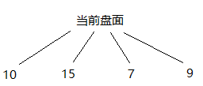
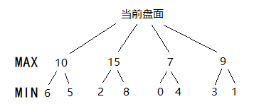
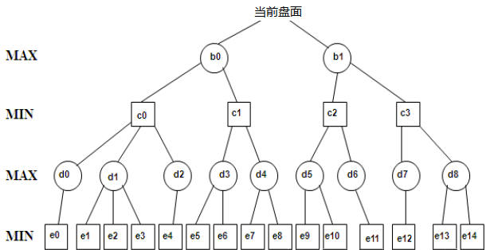

上一章进行了一个五子棋游戏框架的搭建。应该来说，除开AI以外，其他的部分全部写完了。从这章开始，就详细介绍一下五子棋的AI算法。这里说一件非常令人振奋的消息：这章看完之后，你的五子棋AI已经可以下棋了，唯一的缺点就是奇慢无比，但是只要你愿意让他思考足够长的时间，他的棋力绝对是非常棒的了。优化算法将在后续的章节慢慢讲解。

回顾一下上一章的内容，我们需要一个RobotPlayer类，实现Player接口的三个方法：

```java
public class RobotPlayer implements Player {
   private final int color; //1-执黑 2-执白
   public RobotPlayer(int color) { this.color = color; }

   private byte[][] board = new byte[Constant.MAX_LEN][Constant.MAX_LEN]; //对应格子0-空，1-黑，2-白
   // 浅显易懂的set和get方法
   private void set(Point p, int val) { board[p.x][p.y] = (byte) val; }
   private byte get(Point p) { return p == null ? -1 : board[p.x][p.y]; }
   
   @Override
   public void display(Point p) {
      // 接口的第一个方法：display，对方下了哪步棋
      if (get(p) != 0) throw new IllegalArgumentException(p.toString() + get(p)); // 严谨，做个保护
      set(p, 3 - color); // 通知过来的是对方下了哪里，自己如果执黑，则应该标记那个点为白色
   }

   @Override
   public void notifyWinner(int color) {
      // 接口的第二个方法：notifyWinner，告知游戏结束了，谁赢了。
      // 这里我们什么都不用做
   }

   @Override
   public Point play() {
      // 接口的第三个方法：play，本文的重头戏，由AI计算出下一步应该下在哪里，并返回。下文开始重点讲解
   }
}
```

在讲这个play方法之前，我们首先需要掌握一些数学知识。

# 完全信息动态零和博弈

五子棋按照分类属于完全信息动态零和博弈。这里就涉及了很多看上去貌似很复杂的词汇。

首先，博弈就是下棋，或者说就是game，这个很好理解。前面三个词语就需要一一解释了：

- 完全信息：游戏进行的任何时候，双方参与者对棋盘上的全部信息都完全了解。这一点就不像军旗、斗地主、麻将，我并不知道对方的一些信息。
- 动态：双方是轮流下子，每一步棋做决策之前，需要上一步棋的局面状态做出相应的选择。而非石头剪刀布那样，双方同时做决策。
- 零和（zero sum）：或者说是“非合作性”，五子棋不存在任何“双方共同目标”。换句话说，某步棋对这个玩家产生了正价值，则一定对他的对手产生了等量的负价值。关于什么是“非零和博弈”，可以自行搜索一下“囚徒困境”。

对于这类“完全信息动态零和博弈”问题，我们有一种通用的解法。因为是“完全信息”的，我们不需要考虑复杂的概率问题，只需要找到那个最好的决策即可。因为是“零和”的，我们只需要一个评估函数就可以对场上的局面进行评价（我的评分和对方的评分一定互为相反数）。因为是“动态”的，所以要考虑的问题很多，就需要用到后文的“博弈树”进行解决了。

（在这里我要提一句，下文暂时先不考虑国际通用的“索索夫8规则”，包含三手交换、四手交换、五手多打等复杂的变种规则。我们只考虑最普通最原始的规则，简单说就是：谁先连成五个子谁就赢了）

# 评估函数

在讲博弈树之前，我们首先说一下这个评估函数。分析一下五子棋的规则，如果连成了五个就赢了。如果连成了四个子，并且两边都没有被对手堵住，也赢了。如果连成了四个子，并且只有其中一边被对手堵上，则对手下一步必须堵另一边。如果连成了三个子……（此处省略几百个字）同样，如果对手连成了五个就输了，对手连成了四个或者三个……（此处省略几百个字）。想必大家玩过五子棋的人肯定根据经验都知道这些事情，就不浪费篇幅多说了。

根据上述的这些规则和经验，我们可以做一个评估函数的设计，大概是这样的：

```java
public class RobotPlayer implements Player {
   private final int color; //1-执黑 2-执白
   /* 此处省略了上文写了的方法 */
   
   private int evaluateBoard() {
      return evaluateBoard(color) - evaluateBoard(3 - color);
   }

   // 这个函数是评价当前棋盘上仅考虑某一种颜色的得分
   // 想要得到考虑双方棋子的得分，就是自己得分减去对方得分即可evaluateBoard(1) - evaluateBoard(2)
   private int evaluateBoard(int color) {
      int values = 0;
      for (int i = 0; i < Constant.MAX_LEN; i++) {
         for (int j = 0; j < Constant.MAX_LEN; j++) {
            Point p = new Point(i, j);
            // 如果同一个方向有连续5个子，则 values += 1000000;
            // 如果同一个方向有连续4个子并且两边都没有堵住，则 values += 300000;
            // 如果同一个方向有连续4个子并且仅有一边被堵住，则 values += 2500;
            // 如果是***0*的情况，则values += 3000;
            // 如果是**0**的情况，则values += 2600;
            // 如果是“活三”的情况，则values  += 3000
            // 如果是“活三”被堵住了一边，则values += 500;
            // 此处省略约一百行没有难度仅仅是下棋经验的代码
            /*
            这些分值其实自己都可以进行调整，注意控制一下分数
            例如如果场上有两个“活三”，应该和场上有一个“活四”差不多得分，因为都是已经赢了。
            需要注意的是，比如一连串有三个子，其实只需要算一遍价值就够了，不要对于这三个子都算一遍。
            如果有两个子连成一条线，建议也象征性的加少量分数
             */
         }
      }
      return values;
   }
}
```

为什么没有把完整代码贴出来，一是因为篇幅问题，二是因为确实这些代码虽然复杂繁琐，但都只是一些毫无算法难度的游戏规则和经验，与本文的算法关系不大。只要稍微花费一些时间，大家都是可以自行写出来的。

得到了这个评估函数之后，我们就可以回到刚才的数学讨论了，如何决策下一步棋该如何走。

# 博弈树与极大极小值搜索

循序渐进，我们先考虑一步棋，如下图所示：



假设在当前盘面下，我们有四种走法，对于每种走法我们调用上文的评估函数*evaluateBoard*，得到四个得分，显然，我们更倾向于选择最高分15对应的那个走法。换句话说，我们可以认为以当前局面发展，可以到达15分的局面。

现在我们开始考虑两步棋，如下图所示：



假设对于我的这四种走法，对方分别有两种走法进行应对。现在情况开始变得复杂了。我们重新强调一下，这是一个“零和博弈”，也就是说，我的正分一定等于对方的负分。如果我选择了15分这种走法，对方肯定不傻，一定会选择2分这种走法，想让我的分更低。如果我选择了10分这种走法，对方一定会选择5分这种走法。想要将局面变成6分或者8分的结果，是不可能的（除非对面犯傻）。那么对于图上的那种情况，我们分析一下：如果我选第一种走法，则会得到5分；如果我选第二种走法，则会得到2分；如果我选第三种走法，则会得到0分；如果我选第四种走法，则会得到1分。那我到底应该选择哪种走法呢？显然，我更希望两步棋后，局面是5分，我选择了第一种走法。

重新审视一下这个问题，我们不难发现，如果我考虑两步棋，那么第一步棋的得分是没有用的。我的实际求解过程是：先通过每种第一步棋，求得对应的第二步棋的最小得分，再从这些最小得分中，找到那个最大得分。

好了，为了游戏更加精确，我们继续尝试考虑4步棋。自己画图太过麻烦，我就随便搜索了一张图片：



同样，按照上面的思路，我们需要反着考虑。首先考虑第四步棋，这是对方选择的一步棋。对于每一种第三步的局面，对方肯定选择分数最低的一步棋，我们把同一个第三步下的所有第四步的最小值求出来，作为第三步的分数即可。然后对于每个第二步的局面，我肯定选择分数最高的那个第三步，因此只需要求出同一个第二步下的所有第三步的最大值求出来，即可作为第二步的分数。同理，我们继续找第二步的最小值当做第一步的分数。最后再找到第一步的最大值，作为我决策的下一步棋。

以上，就是我们所说的“极小极大值搜索”算法。

值得一提的是，如果我优先下出了五连珠，游戏会立即结束，如果下一步棋对方也下出了五连珠，则我的五连珠调用evaluateBoard(1)减去对方的五连珠调用evaluateBoard(2)等于0，这个情况我们要排除掉，因为我已经先下出五连珠了，游戏已经结束了，对方再下出来的棋是无效的。

推广到连续考虑N步棋，我们可以得到这样的代码：

```java
// 因为下面的算法需要返回这一步棋下在哪里，以及对应这个下法的分数，我就封装了这样一个类
class PointAndValue {
   public final Point point;
   public final int value;
   public PointAndValue(Point point, int value) {
      this.point = point;
      this.value = value;
   }
}

public class RobotPlayer implements Player {
   private final int color; //1-执黑 2-执白
   /* 此处省略了上文写了的方法 */

   private int evaluateBoard() {
      /* 这是上文的评估函数 */
   }
   
   // 参数leftstep是还需要计算几步，color是当前这一步论到谁下
   // 例如打算计算8步棋，则直接这样进行调用即可getMaxEvaluate(8, this.color)
   private PointAndValue getMaxEvaluate(int leftStep, int color) {
      Point maxPoint = null;
      int maxValue = 0;
      for (int i = 0; i < Constant.MAX_LEN; i++) {
         for (int j = 0; j < Constant.MAX_LEN; j++) {
            Point p = new Point(i, j);
            if (get(p) != 0) continue; // 如果这个点已经有子了，则跳过
            // 进一步考虑，如果这个点离棋盘上存在的其他子距离太远了，也可以跳过以减少计算量，代码就不展示了

            set(p, color); // 回溯法，先set，在递归之后再set回来
            
            int val = evaluateBoard();
            // 因为上文给了五连珠1000000分，那么我这里就把大于800000分当做已经出现了五连珠
            // 出现了五连珠，游戏立即结束，不继续递归了
            if (val > 800000) return new PointAndValue(p, val); 
            // 如果不是最后一步，则这个分数是没有用的，需要以下一步的分数的最大（小）值作为这一步的分数，递归
            if (leftStep > 1) {
               PointAndValue nextStep = getMaxEvaluate(leftStep - 1, 3 - color);
               // 这里要注意，递归调用时是从对方的角度算分，所以对方的负分才是我的正分
               val = -nextStep.value;
            }
            if (maxPoint == null || val > maxValue) {
               // 因为这个函数是从当前这一步的那个人的角度算分，所以只需要求最大值即可。想要求最小值，递归之后再取负即可
               maxPoint = p;
               maxValue = val;
            }
        
            set(p, 0); // 回溯法，递归调用之后再set回来
         }
      }
      // 如果棋盘下满了，上面的循环会全部进入if (get(p) != 0) continue;因此最后maxPoint依旧为空
      // 这里应该对maxPoint == null的情况增加一些容错，代码就不展示出来了
      return new PointAndValue(maxPoint, maxValue);
   }
}
```

到此为止，我们就可以用*getMaxEvaluate*方法求出一个“最好的策略”了。把这个方法再进一步组合，我们可以得到play方法：

```java
import java.util.*;

public class RobotPlayer implements Player {
   private final int color; //1-执黑 2-执白
   /* 此处省略了上文写了的方法 */

   private PointAndValue getMaxEvaluate(int leftStep, int color) {
      /* 这是上文的用以计算最好策略的方法 */
   }

   private int count = 0; // 记录一下是目前是第几步棋
   @Override
   public Point play() {
      Point p;
      if (count == 0) {
         // 如果是第一步棋，则直接下在天元位置
         p = new Point(Constant.MAX_LEN / 2, Constant.MAX_LEN / 2);
      } else if (count == 1) {
         // 如果是第二步棋，天元位置是空的就下在天元，否则就下在天元旁边（斜向或直向）。当然也可以选择别的策略
         if (board[Constant.MAX_LEN / 2][Constant.MAX_LEN / 2] == 0)
            p = new Point(Constant.MAX_LEN / 2, Constant.MAX_LEN / 2);
         else if (new Random().nextBoolean())
            p = new Point(Constant.MAX_LEN / 2 - 1, Constant.MAX_LEN / 2);
         else
            p = new Point(Constant.MAX_LEN / 2 - 1, Constant.MAX_LEN / 2 - 1);
      } else {
         // 第三步棋之后开始调用getMaxEvaluate方法，这里我们以搜索深度是8为例
         PointAndValue result = getMaxEvaluate(8, this.color);
         p = result.point;
      }
      set(p, color);
      count++;
      return p;
   }
}
```

好了，至此为止，恭喜你，我们已经可以和AI进行五子棋对弈了。

写完了算法，我们大致看看这个算法的计算量。尽管我们可以排除距离局面太远的点，但是下到中局的时候，我们每一步棋起码也要考虑三四十个点。假设要考虑八步棋，就是30^8^=6561亿个分支，简直庞大的计算量。目前这个算法在搜索深度是4的情况下，可以保证在几秒钟最多一分钟之内计算出结果，如果想要考虑八步甚至十步棋，显然远远是不够的。下一章会介绍α-β剪枝、启发式搜索等一些算法，对目前的算法进行优化。