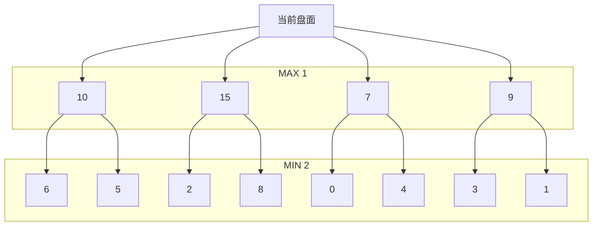

上一章成功的实现了一个五子棋AI，尽管它的性能非常不佳。接下来，我们打算在此基础上进行一系列优化，大幅度提高运算性能。

# α-β剪枝

回顾一下我们上一章说的“极大值极小值搜索”：



按照上一章的方法，首先我们从第一个分支6和5中找到最小值5。接下来，我们找第二个分支，结果我们一上来就看到了2。这个时候我们思考一下，如果后面的数比2大，那么2是最小值；如果后面的数比2小，那么说明最小值比2小。这样一来，我在第二个分支中得到的最小值肯定不会超过2。在第一个分支我们已经得到最小值5了，由于MAX层要找最大值，第二个分支是不会超过2的，所以整个第二个分支下面的所有分支我们都可以放弃了。这就是所谓的“剪枝”。同理，第三个分支找到了0，第四个分支找到了3，都比5小，这两个分支也都不用看了。

这样一来，如果在“运气好”的情况下，每一排只需要看第一个分支即可，后面的分支都可以忽略。这个忽略后面的分支的方法就叫做“剪枝”。

那么代码是怎么写的呢？首先我们拿到上一章的代码过来看一下：

```java
// 这里只展示了getMaxEvaluate函数的代码，其他代码在前面的章节中可以找到
private PointAndValue getMaxEvaluate(int leftStep, int color) {
    Point maxPoint = null;
    int maxValue = 0;
    for (int i = 0; i < Constant.MAX_LEN; i++) {
        for (int j = 0; j < Constant.MAX_LEN; j++) {
            Point p = new Point(i, j);
            if (get(p) != 0) continue; // 如果这个点已经有子了，则跳过
            // 进一步考虑，如果这个点离棋盘上存在的其他子距离太远了，也可以跳过以减少计算量，代码就不展示了
            set(p, color);
            int val = evaluateBoard();
            if (val > 800000) {
            	set(p, 0);
            	return new PointAndValue(p, val);
            }
            if (leftStep > 1) {
               PointAndValue nextStep = getMaxEvaluate(leftStep - 1, 3 - color);
               val = -nextStep.value;
            }
            if (maxPoint == null || val > maxValue) {
               maxPoint = p;
               maxValue = val;
            }
            set(p, 0);
        }
    }
    // 如果棋盘下满了，上面的循环会全部进入if (get(p) != 0) continue;因此最后maxPoint依旧为空
    // 这里应该对maxPoint == null的情况增加一些容错，代码就不展示出来了
    return new PointAndValue(maxPoint, maxValue);
}
```

观察一下，`for`循环就相当于博弈树的一个节点下的不同分支，而中间的递归调用相当于进入下一个子节点。我们需要修改的是，在递归调用的时候，将已经遍历过的子节点中得到过的极大值（或极小值）传给未遍历过的节点，若未遍历过的节点中已经发现满足剪枝的条件时进行剪枝即可。

我们把上面的代码稍加修改

```java
private PointAndValue getMaxEvaluate(int leftStep, int color, int passValue) {// 这个passValue就是其他节点传过来的值
    Point maxPoint = null;
    int maxValue = -Integer.MAX_VALUE;
    for (int i = 0; i < Constant.MAX_LEN; i++) {
        for (int j = 0; j < Constant.MAX_LEN; j++) {
            Point p = new Point(i, j);
            if (get(p) != 0) continue; // 如果这个点已经有子了，则跳过
            // 进一步考虑，如果这个点离棋盘上存在的其他子距离太远了，也可以跳过以减少计算量，代码就不展示了
            set(p, color);
            int val = evaluateBoard();
            if (val > 800000) {
            	set(p, 0);
            	return new PointAndValue(p, val);
            }
            if (leftStep > 1) {
               PointAndValue nextStep = getMaxEvaluate(leftStep - 1, 3 - color, -maxValue);
               if (nextStep.value >= passValue) { // α-β剪枝
                   set(p, 0);
                   return new PointAndValue(p, nextStep.value);
               }
               val = -nextStep.value;
            }
            if (maxPoint == null || val > maxValue) {
               maxPoint = p;
               maxValue = val;
            }
            set(p, 0);
        }
    }
    // 如果棋盘下满了，上面的循环会全部进入if (get(p) != 0) continue;因此最后maxPoint依旧为空
    // 这里应该对maxPoint == null的情况增加一些容错，代码就不展示出来了
    return new PointAndValue(maxPoint, maxValue);
}
```

好了，经历了α-β剪枝之后，在“运气好”的情况下，可以省去很多的进一步遍历。

# 启发式搜索

上面多次着重强调了“运气好”这三个字，那么也就是说，我们的运气并不是一直都这么好。如果算法仅仅适用于运气好，那么就不通用了。

首先，我们想一下。什么样的点，容易出现上述的“极大值”（或者“极小值”）？显然，那些对胜负至关重要的点，相比那些不重要的点，更容易出现极值。那么，我们在遍历下一层之前，先交换一下遍历的顺序，让重要的点先进行遍历，就更加容易出现之前所说的“运气好”的情况——更容易很快出现极值。那么我们首先需要一个函数，来给每个点一个评估，它到底对胜负是否非常重要，这个函数就被称为“启发式搜索”函数。（这段代码看似很长，其实并无含金量，原本打算不贴出来的，但想了想还是补上了，方便读者节约时间，不在这个问题上浪费太多时间）

```java
public int evaluatePoint(Point p, int color) {
	return evaluatePoint(p, color, 1) + evaluatePoint(p, color, 2);
}

private int evaluatePoint(Point p, int me, int plyer) {
	int value = 0;
	int numoftwo = 0;
	for (Direction dir : Direction.values()) { // 8个方向
		// 活四 01111* *代表当前空位置 0代表其他空位置 下同
		if (getLine(p, dir, -1) == plyer && getLine(p, dir, -2) == plyer && getLine(p, dir, -3) == plyer
				&& getLine(p, dir, -4) == plyer && getLine(p, dir, -5) == 0) {
			value += 300000;
			if (me != plyer) {
				value -= 500;
			}
			continue;
		}
		// 死四A 21111*
		if (getLine(p, dir, -1) == plyer && getLine(p, dir, -2) == plyer && getLine(p, dir, -3) == plyer
				&& getLine(p, dir, -4) == plyer && (getLine(p, dir, -5) == 3 - plyer || getLine(p, dir, -5) == -1)) {
			value += 250000;
			if (me != plyer) {
				value -= 500;
			}
			continue;
		}
		// 死四B 111*1
		if (getLine(p, dir, -1) == plyer && getLine(p, dir, -2) == plyer && getLine(p, dir, -3) == plyer
				&& getLine(p, dir, 1) == plyer) {
			value += 240000;
			if (me != plyer) {
				value -= 500;
			}
			continue;
		}
		// 死四C 11*11
		if (getLine(p, dir, -1) == plyer && getLine(p, dir, -2) == plyer && getLine(p, dir, 1) == plyer
				&& getLine(p, dir, 2) == plyer) {
			value += 230000;
			if (me != plyer) {
				value -= 500;
			}
			continue;
		}
		// 活三 近3位置 111*0
		if (getLine(p, dir, -1) == plyer && getLine(p, dir, -2) == plyer && getLine(p, dir, -3) == plyer) {
			if (getLine(p, dir, 1) == 0) {
				value += 1450;
				if (getLine(p, dir, -4) == 0) {
					value += 6000;
					if (me != plyer) {
						value -= 300;
					}
				}
			}
			if ((getLine(p, dir, 1) == 3 - plyer || getLine(p, dir, 1) == -1) && getLine(p, dir, -4) == 0) {
				value += 500;
			}
			if ((getLine(p, dir, -4) == 3 - plyer || getLine(p, dir, -4) == -1) && getLine(p, dir, 1) == 0) {
				value += 500;
			}
			continue;
		}
		// 活三 远3位置 1110*
		if (getLine(p, dir, -1) == 0 && getLine(p, dir, -2) == plyer && getLine(p, dir, -3) == plyer
				&& getLine(p, dir, -4) == plyer) {
			value += 350;
			continue;
		}
		// 死三 11*1
		if (getLine(p, dir, -1) == plyer && getLine(p, dir, -2) == plyer && getLine(p, dir, 1) == plyer) {
			value += 700;
			if (getLine(p, dir, -3) == 0 && getLine(p, dir, 2) == 0) {
				value += 6700;
				continue;
			}
			if ((getLine(p, dir, -3) == 3 - plyer || getLine(p, dir, -3) == -1)
					&& (getLine(p, dir, 2) == 3 - plyer || getLine(p, dir, 2) == -1)) {
				value -= 700;
				continue;
			} else {
				value += 800;
				continue;
			}
		}
		// 活二的个数（因为会算2次，就2倍）
		if (getLine(p, dir, -1) == plyer && getLine(p, dir, -2) == plyer && getLine(p, dir, -3) == 0
				&& getLine(p, dir, 1) == 0) {
			if (getLine(p, dir, 2) == 0 || getLine(p, dir, -4) == 0)
				numoftwo += 2;
			else
				value += 250;
		}
		if (getLine(p, dir, -1) == plyer && getLine(p, dir, -2) == 0 && getLine(p, dir, 2) == plyer
				&& getLine(p, dir, 1) == 0 && getLine(p, dir, 3) == 0) {
			numoftwo += 2;
		}
		if (getLine(p, dir, -1) == 0 && getLine(p, dir, 4) == 0 && getLine(p, dir, 3) == plyer
				&& (getLine(p, dir, 2) == plyer && getLine(p, dir, 1) == 0 || getLine(p, dir, 1) == plyer && getLine(p, dir, 2) == 0)) {
			numoftwo += 2;
		}
		if (getLine(p, dir, -1) == plyer && getLine(p, dir, 1) == plyer && getLine(p, dir, -2) == 0
				&& getLine(p, dir, 2) == 0) {
			if (getLine(p, dir, 3) == 0 || getLine(p, dir, -3) == 0)
				numoftwo++;
			else
				value += 125;
		}
		// 其余散棋
		int numOfplyer = 0;
		for (int k = -4; k <= 0; k++) { // ++++* +++*+ ++*++ +*+++ *++++
			int temp = 0;
			for (int l = 0; l <= 4; l++) {
				if (getLine(p, dir, k + l) == plyer) {
					temp += 5 - Math.abs(k + l);
				} else if (getLine(p, dir, k + l) == 3 - plyer || getLine(p, dir, k + l) == -1) {
					temp = 0;
					break;
				}
			}
			numOfplyer += temp;
		}
		value += numOfplyer * 5;
	}
	numoftwo /= 2;
	if (numoftwo >= 2) {
		value += 3000;
		if (me != plyer) {
			value -= 100;
		}
	} else if (numoftwo == 1) {
		value += 2725;
		if (me != plyer) {
			value -= 10;
		}
	}
	return value;
}
```

参数`p`表示接下来要计算的点，`me`表示调用这个函数的那一方自己的颜色，`plyer`代表接下来要计算的人的编号。一个点对两方的重要性之和，就是我们需要的结果。这样我们就可以大致得到了一个对单个点的价值评估函数，也就是“启发式搜索”函数。

值得一提的是，这里的这些数字，其实都是凭个人感觉写的（例如四肯定比三重要，例如活四就直接赢了那我肯定优先走活四），并且多次测试后慢慢调整的，所以不精确。将来如果有机会，我打算用其他的方法来给这些数字一些更加科学的值。

然后我们在遍历之前，排个序即可。这里偷点懒，直接用了优先队列`PriorityQueue`。

```java
private PointAndValue max(int leftStep, int color, int passValue) {
	PriorityQueue<PointAndValue> queue = new PriorityQueue<>((obj1, obj2)->Integer.compare(obj2.value, obj1.value));
	for (int i = 0; i < Constant.MAX_LEN; i++) {
		for (int j = 0; j < Constant.MAX_LEN; j++) {
			Point p = new Point(j, i);
			if (board.get(p) == 0 && board.isNeighbor(p)) {
				int evathis = evaluatePoint(p, colorNext);
				queue.add(new PointAndValue(p, evathis));
			}
		}
	}
	//下面的代码循环就从优先队列的头开始循环，而不再需要从左上角到右下角一一遍历了
	//循环代码和上文基本一样，就不再赘述了
}
```

从减少遍历次数的方法对博弈树的极大极小值搜索进行优化，就基本到这里为止了。其实还有一些非算法方法带来的技巧，例如暂时存储算过的数据等，就不是这个算法需要讨论的内容了。

repo中的代码还用到了两个额外的技巧：

- 关于棋盘的Hash算法——**Zobrist哈希算法**。用了这个算法，我们可以快速把棋盘当前状态hash成一个`int`值，作为`map`的key，可用于存储已算出的数据，不需要每次再重复计算。
- 除了**减枝**外，还有一个**增枝**的算法，就是对于重要的枝叶进行增长以提高准确度。当然了，我们肯定是对那些带有杀招（冲四、活三等）的棋进行增枝。

如果后续有时间的话我会再把这两种算法的文字说明补上。